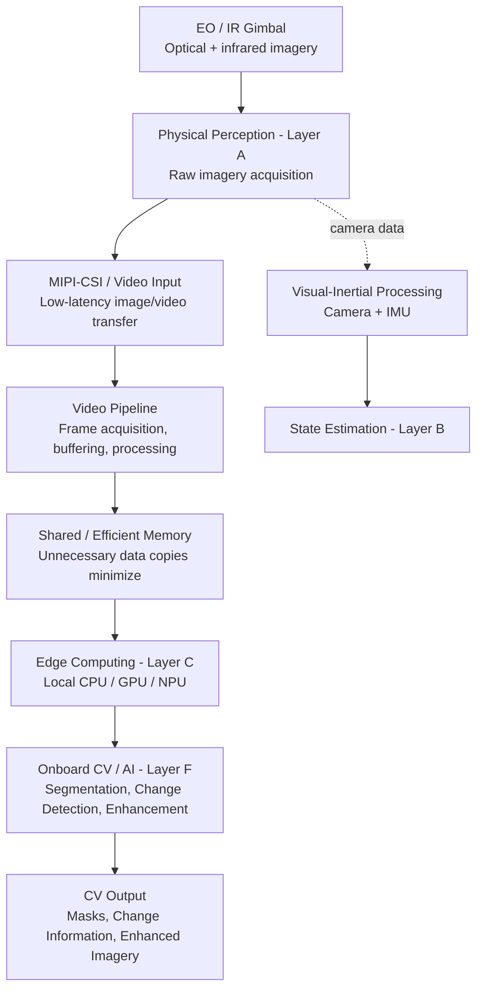

# Project Rudra RE-T1 (Spectra) — Computer Vision Architecture Notes

| Field | Detail |
|---|---|
| **Project** | Rudra Edge RE-T1 (Spectra) |
| **Engineer** | Aryan |
| **Role** | Computer Vision Engineer |
| **Task Order Reference** | REA/2026/RE-T1/TRAIN-001 |
| **Task** | Vision Architecture Study — RE-T1 perception architecture and multi-spectral EO/IR layout |
| **Date** | 05 October 2026 |
| **Cost** | ₹0 (local documentation + open-source tools only) |

> **Note on scope:** Is document me do type ki information hai.
> - **[RE-T1]** = project documentation me explicitly mentioned cheezein.
> - **[Background]** = general CV / embedded-vision theory jo concept samajhne ke liye add ki gayi hai. Ye RE-T1 ka confirmed design nahi hai.

---

## Table of Contents

1. [Overview](#1-overview)
2. [Multi-Spectral EO/IR Perception](#2-multi-spectral-eoir-perception)
3. [8-Layer PECLF Architecture — CV View](#3-8-layer-peclf-architecture--cv-view)
4. [Complete CV Data Flow](#4-complete-cv-data-flow)
5. [Video Ingestion and Processing](#5-video-ingestion-and-processing)
6. [Zero-Copy / Shared Memory](#6-zero-copy--shared-memory)
7. [Edge Computing — Layer C](#7-edge-computing--layer-c)
8. [Onboard Intelligence — Layer F](#8-onboard-intelligence--layer-f)
9. [Semantic Segmentation](#9-semantic-segmentation)
10. [Temporal Visual Change Detection](#10-temporal-visual-change-detection)
11. [Neural Super-Resolution and Denoising](#11-neural-super-resolution-and-denoising)
12. [Visual-Inertial Path (Layer B)](#12-visual-inertial-path-layer-b)
13. [CV Architecture — Mental Model](#13-cv-architecture--mental-model)
14. [Key Terms / Glossary](#14-key-terms--glossary)
15. [Open Questions and Next Steps](#15-open-questions-and-next-steps)

---

## 1. Overview

**[RE-T1]** RE-T1 ka perception system multiple sensing aur processing layers ko ek **distributed architecture** me organize karta hai. Computer Vision ke perspective se sabse important components ye hain:

1. **EO/IR physical perception** — optical + infrared sensing
2. **Video / data ingestion** — sensor se frames processing system tak lana
3. **Local edge computation** — CPU / GPU / NPU par processing
4. **Onboard AI/CV processing** — segmentation, change detection, enhancement

### Core idea

Sensor se aane wali **raw imagery ko locally process** karke **useful visual information** generate ki jaati hai. Processing external cloud par depend nahi karti; saari computation onboard / local edge resources par hoti hai (**zero-cloud**).

### Ye approach kyun?

**[Background]** UAV / edge platforms par cloud-dependent vision usually problematic hoti hai:

| Concern | Cloud-based vision | Local edge vision (RE-T1 approach) |
|---|---|---|
| Latency | Network round-trip add hota hai | Sirf local compute latency |
| Connectivity | Link loss = system blind | Link ke bina bhi kaam karta hai |
| Bandwidth | Raw video upload bahut heavy | Sirf results (masks, change info) bahar jaate hain |
| Reliability | Network par dependent | Self-contained |

---

## 2. Multi-Spectral EO/IR Perception

### 2.1 EO — Electro-Optical

- **[RE-T1]** Optical / visible imagery provide karta hai.
- Is imagery me scene ki **visual appearance, shapes, textures** aur visible-spectrum information available hoti hai.
- **[Background]** Strength: high resolution aur rich texture detail. Limitation: low light, night, aur haze / smoke me performance girti hai.

### 2.2 IR — Infrared

- **[RE-T1]** Infrared / thermal information provide karta hai.
- RE-T1 documentation EO/IR ko **multi-spectral physical perception** ka part describe karti hai, jisse **day/night visual perception** support hoti hai.
- **[Background]** Thermal imagery object ke temperature / heat emission par based hoti hai, isliye andhere me bhi kaam karti hai. Limitation: EO ke comparison me resolution aur fine texture kam hoti hai.

### 2.3 EO vs IR — Quick Comparison

| Aspect | EO (Optical) | IR (Thermal / Infrared) |
|---|---|---|
| Information | Colour, shape, texture | Heat / thermal signature |
| Day operation | Strong | Strong |
| Night operation | Weak (bina illumination) | Strong |
| Detail level | Zyada fine detail | Comparatively kam detail |
| CV challenge | Illumination change | Low resolution, noise |

> **Multi-spectral ka fayda:** dono sensors ki strengths combine hoti hain, isliye ek hi spectrum ki limitation par system depend nahi karta.

### 2.4 Gyro-Stabilized EO/IR Gimbal

- **[RE-T1]** EO/IR imaging ko **stabilized gimbal** ke through physical perception layer me place kiya gaya hai.
- **CV pipeline ke liye role:** stable optical / thermal imagery provide karna.
- **[Background]** Stabilization se motion blur aur frame-to-frame jitter kam hota hai. Isse segmentation, change detection aur tracking jaise tasks ki input quality behtar hoti hai.

---

## 3. 8-Layer PECLF Architecture — CV View

**[RE-T1]** Study me ye layers CV ke liye relevant paayi gayi:

| Layer | Architecture Component | Computer Vision Connection |
|---|---|---|
| **A** | Physical Perception (Data Ingestion / Environment Perception) | EO/IR imagery aur other sensor data ka raw acquisition. MIPI-CSI, CAN, SPI, UART jaise interfaces architecture me mentioned hain. |
| **B** | Autonomous State Estimation | Visual-inertial information ka use state estimation / navigation ke liye. Camera data navigation-side processing me bhi useful hai. |
| **C** | Zero-Cloud Computation / Edge Computing | Local CPU / GPU / NPU par high-performance processing. External cloud dependency nahi. |
| **F** | Onboard Intelligence Engine | Pixel-level segmentation, Siamese visual change detection aur neural imagery enhancement / super-resolution. |

### Layers ka CV-side relationship

```
Layer A  ──►  Layer C  ──►  Layer F
(sensing)    (compute)     (CV / AI output)
    │
    └──────►  Layer B
              (visual-inertial state estimation)
```

- **Layer A** data **generate** karta hai.
- **Layer C** data ko **process karne ki capability** deta hai.
- **Layer F** us processing se **meaningful visual intelligence** nikalta hai.
- **Layer B** camera data ko navigation / state estimation me use karta hai.

> Layers D, E, G, H is CV-focused study ke scope me nahi aaye. Unka detail baaki team members ke notes me hoga.

---

## 4. Complete CV Data Flow



### Flow ko step-by-step samajhna

| # | Stage | Kya hota hai |
|---|---|---|
| 1 | EO/IR Gimbal | Optical aur thermal imagery capture hoti hai |
| 2 | Layer A | Raw imagery acquire hoti hai |
| 3 | MIPI-CSI | Frames low-latency ke saath processing system tak transfer hote hain |
| 4 | Video Pipeline | Frame acquisition, buffering aur processing |
| 5 | Shared Memory | Unnecessary copies avoid hoti hain |
| 6 | Layer C | Local CPU / GPU / NPU par compute |
| 7 | Layer F | Segmentation, change detection, enhancement |
| 8 | CV Output | Masks, change information, enhanced imagery downstream components ko milti hai |

**Parallel path:** Camera / visual information + IMU → visual-inertial processing → state estimation. Ye perception data ka **navigation / state-estimation use-case** hai.

---

## 5. Video Ingestion and Processing

Camera / sensor se aane wali imagery ko processing system tak **efficiently deliver karna** CV pipeline ka **first technical stage** hai.

### 5.1 Pipeline Stages

| Stage | Meaning |
|---|---|
| **Capture** | EO/IR sensor se image / video frames receive hote hain. |
| **Transport** | Hardware interface ke through frame processing system tak aata hai; architecture me **MIPI-CSI** important path hai. |
| **Buffering** | Frames ko temporary / shared buffers me manage kiya jaata hai. |
| **Processing** | Frame ko local compute resources par process kiya jaata hai. |
| **Inference** | CV / AI model imagery se required information extract karta hai. |
| **Output** | Processed visual information downstream components ko provide hoti hai. |

### 5.2 MIPI-CSI

- **[RE-T1]** MIPI-CSI architecture me important **camera path** hai.
- **[Background]** MIPI-CSI (Camera Serial Interface) ek high-speed serial interface hai jo image sensor se processor tak pixel data bhejta hai. Embedded / edge platforms par ye camera connect karne ka common tarika hai.
- Is interface ka CV ke liye matlab: **low-latency, high-bandwidth** frame delivery.

### 5.3 Sensor Interfaces — Layer A

**[RE-T1]** Layer A me ye interfaces mentioned hain:

| Interface | CV-side relevance |
|---|---|
| **MIPI-CSI** | Camera / image data (primary CV path) |
| **CAN** | Vehicle / system-level communication (non-image) |
| **SPI** | Sensor communication (non-image) |
| **UART** | Serial communication (non-image) |

> CV pipeline ka main input MIPI-CSI se aata hai. Baaki interfaces mostly non-image sensors / system data ke liye hain.

### 5.4 Pipeline Quality Metrics

**[Background]** Video pipeline ko evaluate karte waqt ye metrics dekhne chahiye:

| Metric | Matlab |
|---|---|
| **Latency** | Frame capture se output tak ka total time |
| **FPS** | Per second kitne frames process hote hain |
| **Throughput** | Pipeline ki sustained processing capacity |
| **Memory usage** | Buffers aur model ke liye RAM / GPU memory |
| **Frame drop** | Processing slow hone par miss hone wale frames |

---

## 6. Zero-Copy / Shared Memory

### 6.1 Problem

High-performance vision pipeline me same frame ko baar-baar copy karna **latency** aur **memory-bandwidth overhead** create karta hai.

**Traditional (inefficient) idea:**

```
Camera → CPU buffer → GPU buffer → CPU buffer → GPU buffer → Model
              ↑ copy      ↑ copy       ↑ copy       ↑ copy
```

### 6.2 Efficient idea

Frame ko **shared / efficient memory path** ke through processing stages tak pahunchaya jaye, taaki unnecessary CPU↔GPU / data-buffer transfers **minimize** hon.

```
Camera → Shared memory buffer ──► (GPU / NPU / CPU read same buffer) → Model
```

### 6.3 Project context

- **[RE-T1]** Project architecture **zero-copy GPU / shared-memory processing** ko high-performance edge video pipeline ke context me use karti hai.
- **Goals:**
  1. Latency kam karna
  2. Data movement reduce karna
  3. High-throughput processing support karna

### 6.4 Zero-copy kyun matter karta hai

**[Background]** Ek simple calculation se idea aata hai. Ek uncompressed 1920×1080 RGB frame ka size:

```
1920 × 1080 × 3 bytes ≈ 6.2 MB per frame
```

30 FPS par agar har frame 4 baar copy ho:

```
6.2 MB × 4 copies × 30 FPS ≈ 745 MB/s extra memory traffic
```

Ye sirf **copying** ki wajah se hai, actual processing se pehle. Edge devices par memory bandwidth limited aur shared hoti hai, isliye copies minimize karna zaroori hai.

> Ye numbers sirf illustration ke liye hain, RE-T1 ki confirmed resolution ya FPS nahi hain.

---

## 7. Edge Computing — Layer C

- **[RE-T1]** Layer C **local heterogeneous computing architecture** provide karta hai.
- Processing **CPU, GPU aur NPU** jaise local compute resources par distribute ho sakti hai.
- **Zero-cloud** ka matlab: core perception / CV processing ke liye **external cloud service par dependency nahi**.
- Project documents local edge platforms ka reference dete hain, including **NVIDIA Jetson** aur **indigenous processor platforms**.

### 7.1 CPU / GPU / NPU — Roles

**[Background]** General roles:

| Unit | Typical role in vision pipeline |
|---|---|
| **CPU** | Control logic, pre/post-processing, flexible tasks |
| **GPU** | Parallel pixel / tensor operations, neural network inference |
| **NPU** | Dedicated neural-network accelerator, power-efficient inference |

Heterogeneous design ka point: har task us unit par chalaya jaye jo uske liye best ho.

### 7.2 Edge constraints

**[Background]** Edge AI me hamesha ye trade-offs dhyan me rakhne hote hain:

- **Power budget** — UAV battery limited hoti hai
- **Thermal limits** — heavy inference se device garam hota hai
- **Memory** — model size aur frame buffers dono ko fit hona hai
- **Real-time deadline** — frame ke aate hi result time par chahiye

---

## 8. Onboard Intelligence — Layer F

**[RE-T1]** Layer F RE-T1 ka **main onboard CV / AI intelligence area** hai. Project documentation me teen major imagery-processing capabilities explicitly described hain:

| # | Capability | Input | Output |
|---|---|---|---|
| 1 | **Pixel-level segmentation** | Single image | Segmentation mask |
| 2 | **Temporal visual change detection** (Siamese NN) | Earlier + current image | Change map |
| 3 | **Neural super-resolution / denoising** | Degraded / low-res image | Enhanced image |

Teeno capabilities ka detail neeche sections 9, 10 aur 11 me hai.

---

## 9. Semantic Segmentation

### 9.1 Definition

Semantic segmentation image ke **individual pixels ko classes / regions ke according classify** karta hai. Output generally ek **pixel-level mask** hota hai, jo batata hai ki image ka kaunsa region kis class se belong karta hai.

### 9.2 Flow

```
Input Image → Neural Network → Pixel-wise Prediction → Segmentation Mask
```

### 9.3 RE-T1 context

- **[RE-T1]** Segmentation ko **terrain / visual scene understanding** aur **pixel-level object highlighting** ke context me use kiya gaya hai.

### 9.4 Samajhne ke liye

**[Background]**

| Task | Output | Granularity |
|---|---|---|
| Classification | Poori image ka ek label | Image-level |
| Object detection | Bounding boxes + labels | Box-level |
| **Semantic segmentation** | Har pixel ka class label | **Pixel-level** |

Example (illustration): ek aerial image me har pixel ko `road`, `vegetation`, `building`, `water` jaisi class assign ho sakti hai. Final mask me har class ka alag region dikhega.

### 9.5 Typical evaluation metrics

**[Background]**

- **Pixel accuracy** — sahi classify hue pixels ka fraction
- **IoU (Intersection over Union)** — predicted aur ground-truth region ka overlap
- **mIoU** — sabhi classes ka average IoU

---

## 10. Temporal Visual Change Detection

### 10.1 Objective

**Alag-alag time points ki imagery ko compare** karke visual changes identify karna.

### 10.2 Approach

- **[RE-T1]** Project architecture me **Siamese Neural Network based visual change detection** ka reference hai.
- Core idea: **temporal visual information** se changes identify karna, **sirf ek single frame ko independently analyze karne ke bajay**.

### 10.3 Basic flow

```
Earlier Image ─┐
               ├─► Feature Extraction / Comparison ─► Change Information ─► Change Map
Current Image ─┘
```

### 10.4 Siamese network — concept

**[Background]**

- Siamese network me **do identical branches (shared weights)** hoti hain.
- Dono images same network se guzarti hain, isliye dono ke features **same feature space** me aate hain.
- Phir un features ka **difference / distance** nikala jaata hai. Jahan difference zyada hota hai, wahan change mark hota hai.

```
Image T1 ──► [ Shared-weight Encoder ] ──► features F1 ─┐
                                                        ├─► |F1 − F2| ─► Decoder ─► Change Map
Image T2 ──► [ Shared-weight Encoder ] ──► features F2 ─┘
```

### 10.5 Practical challenges

**[Background]** Change detection me ye cheezein tricky hoti hain:

| Challenge | Explanation |
|---|---|
| **Registration / alignment** | Dono images same view se align honi chahiye, warna camera motion bhi "change" lagega |
| **Illumination difference** | Alag samay par lighting alag hoti hai |
| **Irrelevant changes** | Shadows, seasonal changes, noise ko real change se alag karna |
| **Sensor difference** | EO vs IR images ko directly compare karna mushkil hota hai |

---

## 11. Neural Super-Resolution and Denoising

### 11.1 Definitions

- **Super-resolution (SR):** low-resolution imagery se **higher-detail representation** generate karna.
- **Denoising:** sensor imagery me **unwanted noise reduce** karna.

### 11.2 RE-T1 context

- **[RE-T1]** RE-T1 documents neural super-resolution aur denoising ko **degraded optical / thermal imagery** ke context me **onboard imagery enhancement capability** ke roop me describe karte hain.

### 11.3 Flow

```
Degraded / Low-Resolution Image → Enhancement Model → Improved Image → Downstream CV Processing
```

### 11.4 Enhancement ka downstream role

Enhanced image khud final goal nahi hai; ye **downstream CV tasks** (jaise segmentation aur change detection) ki input quality improve karti hai.

**[Background]** Thermal imagery me typically low resolution aur sensor noise hota hai, isliye wahan enhancement khaas useful ho sakti hai.

### 11.5 Dhyan dene wali baat

**[Background]** Neural super-resolution detail **estimate** karta hai, **recover** nahi. Matlab model plausible detail bana sakta hai jo original scene me actually na ho. Isliye safety-critical decisions me enhanced image ko raw image ke saath cross-check karna chahiye.

---

## 12. Visual-Inertial Path (Layer B)

- **[RE-T1]** Camera / visual information + **IMU** → visual-inertial processing → **state estimation**.
- Ye perception data ka **navigation / state-estimation use-case** hai, aur Layer B se connected hai.

**[Background]**

- IMU high-rate motion data deta hai (acceleration, angular rate), lekin time ke saath drift accumulate hota hai.
- Camera drift ko correct karne me madad karta hai, aur IMU fast motion ke beech me camera frames ke gaps bharta hai.
- Dono ka combination (**visual-inertial**) isliye popular hai, khaaskar jab GPS available na ho.

---

## 13. CV Architecture — Mental Model

| Question | Answer |
|---|---|
| Visual data kahan se aata hai? | EO/IR perception sensors / gimbal |
| System me kaise enter hota hai? | Hardware video / data interfaces; MIPI-CSI important camera path hai |
| Frame kaise handle hota hai? | Video pipeline + buffering + efficient memory handling |
| Processing kahan hoti hai? | Local edge CPU / GPU / NPU |
| Main CV intelligence kya hai? | Semantic segmentation + temporal change detection + enhancement / super-resolution |
| Final visual information kya hai? | Pixel masks, visual change information aur enhanced imagery |

### One-line summary

> **EO/IR imagery → physical perception → MIPI-CSI / video ingestion → efficient memory / video pipeline → local edge compute → onboard CV/AI → segmentation, change detection aur imagery enhancement.**

---

## 14. Key Terms / Glossary

| Term | Meaning |
|---|---|
| **EO/IR** | Optical + infrared / thermal visual sensing |
| **Gimbal** | Stabilized mount jo camera ko motion se isolate karta hai |
| **PECLF** | RE-T1 ki 8-layer architecture (is document me A, B, C, F covered) |
| **MIPI-CSI** | Camera / image data ko processing system tak lane ka high-speed hardware interface |
| **Video Pipeline** | Capture, buffer, process aur output ka continuous data path |
| **Zero-Copy** | Unnecessary data copies minimize karke latency aur memory overhead reduce karna |
| **Edge AI** | AI / CV inference ko local onboard CPU / GPU / NPU par run karna |
| **Zero-Cloud** | Core processing ke liye external cloud par dependency nahi |
| **NPU** | Neural network inference ke liye dedicated accelerator |
| **Semantic Segmentation** | Pixel-level scene / object classification through masks |
| **Siamese Network** | Shared-weight twin branches; do inputs ke features compare karne ke liye |
| **Change Map** | Do time points ke beech detected changes ka pixel-level map |
| **Super-Resolution** | Low-resolution imagery ko higher-detail representation me enhance karna |
| **Denoising** | Image noise reduce karke visual quality improve karna |
| **IMU** | Inertial Measurement Unit (acceleration + angular rate) |
| **IoU / mIoU** | Segmentation overlap metric / class-wise average |

---

## 15. Open Questions and Next Steps

### Abhi documentation se clear nahi hua

- Exact sensor resolutions aur frame rates
- Specific segmentation classes aur model architecture
- Specific edge platform / NPU final selection
- EO aur IR streams ka fusion kaise hoga (alag process ya combined)

### Next task

**OpenCV Pipeline Fundamentals — local image / stream handling** (scheduled: **06 October 2026**)

Is task me ye cheezein cover hongi:

- [ ] Local image read / write / display
- [ ] Video file aur camera stream handling
- [ ] Basic frame loop aur FPS measurement
- [ ] Is architecture ke stages (capture → process → output) ka simple local prototype

---

*Prepared for: Project Rudra RE-T1 (Spectra) — Daily Engineering Log, 05 October 2026*
